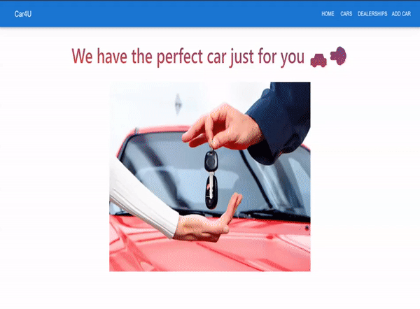

# 

Buy or sell used cars through a dealership.

# Description

Car4U is a single page application built with React.jsx and material UI for css on the client side. Ruby with Sinatra and ActiveRecord on the server side. Existing data were planted within the seed.rb file using faker gem. There are 4 main features for the app, which follows CRUD actions.

Users can:

1. Add used cars which they can sell through a dealership (Create).
2. Access the lists of all cars and dealerships (Read).
3. Edit existing cars in the list (Update).
4. Delete the car once it is sold (Delete).

### Model Relationship Diagram

Cars and dealerships have one to many association. Cars belong to a dealership and dealership has many cars.

# 

## How To Use



# Getting Started

## Fork and Clone

[GitHub Repository Frontend](https://github.com/thyoon515/phase-3-project-frontend)
\
[GitHub Repository Backend](https://github.com/thyoon515/phase-3-project-backend)

- Once you are in the GitHub repository click Code button then clone SSH

- In your terminal write git clone then paste the cloned SSH

```console
$ git clone <Paste cloned SSH>
```

## Backend Setup

Run `bundle install` to install the gems.

You can start your server with:

```console
$ bundle exec rake server
```

This will run your server on port
[http://localhost:9292](http://localhost:9292).

## Frontend Setup

`cd` out of the backend project directory, then `cd` into your frontend to `install` and `start` yarn.

```console
$ npm install yarn
$ yarn start
```
This will run the app in the development mode.
[http://localhost:3000](http://localhost:3000) to view it in your browser.


# Credit

- Car4U Banner : [Banner Maker](https://banner.godori.dev)
- Data Relationship Diagram : [dbdiagram.io](https://dbdiagram.io/home)
- Flatiron School : [FlatironSchool](https://flatironschool.com/)
- GIF : [Video-to-gif](https://ezgif.com/video-to-gif)
- Material UI : [MUI](https://mui.com/)