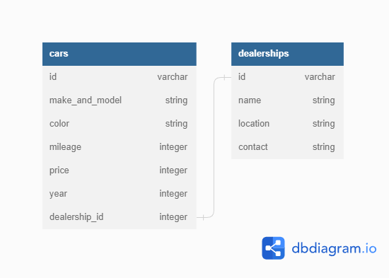

# 

Buy or sell used cars through a dealership.

# Description

Car4U is a single page application built with React.jsx and material UI for css on the client side. Ruby with Sinatra and ActiveRecord on the server side. Existing data were planted within the seed.rb file using faker gem. There are 4 main features for the app, which follows CRUD actions.

Users can:

1. Add used cars which they can sell through a dealership (Create).
2. Access the lists of all cars and dealerships (Read).
3. Edit existing cars in the list (Update).
4. Delete the car once it is sold (Delete).

### Model Relationship Diagram

Cars and dealerships have one to many association. Cars belong to a dealership and dealership has many cars.

# 

## How To Use


# Getting Started

## Backend Setup

This repository has all the starter code needed to get a Sinatra backend up and
running. [**Fork and clone**][fork link] this repository to get started. Then, run
`bundle install` to install the gems.

You can start your server with:

```console
$ bundle exec rake server
```

This will run your server on port
[http://localhost:9292](http://localhost:9292).

## Frontend Setup

Create a new repository in a **separate folder** with a React app for your
frontend. To do this, `cd` out of the backend project directory, and use
[create-react-app][] to generate the necessary code for your React frontend:

```console
$ npx create-react-app my-app-frontend
```

After creating the project locally, you should also
[create a repository on GitHub][create repo] to host your repo and help
collaborate, if you're working with a partner.

## Create React App

This project was bootstrapped with [Create React App](https://github.com/facebook/create-react-app).

## Available Scripts

In the project directory, you can run:

### `yarn start`

Runs the app in the development mode.\
Open [http://localhost:3000](http://localhost:3000) to view it in your browser.

The page will reload when you make changes.\
You may also see any lint errors in the console.

### `yarn test`

Launches the test runner in the interactive watch mode.\
See the section about [running tests](https://facebook.github.io/create-react-app/docs/running-tests) for more information.

### `yarn build`

Builds the app for production to the `build` folder.\
It correctly bundles React in production mode and optimizes the build for the best performance.

The build is minified and the filenames include the hashes.\
Your app is ready to be deployed!

See the section about [deployment](https://facebook.github.io/create-react-app/docs/deployment) for more information.

### `yarn eject`

**Note: this is a one-way operation. Once you `eject`, you can't go back!**

If you aren't satisfied with the build tool and configuration choices, you can `eject` at any time. This command will remove the single build dependency from your project.

Instead, it will copy all the configuration files and the transitive dependencies (webpack, Babel, ESLint, etc) right into your project so you have full control over them. All of the commands except `eject` will still work, but they will point to the copied scripts so you can tweak them. At this point you're on your own.

You don't have to ever use `eject`. The curated feature set is suitable for small and middle deployments, and you shouldn't feel obligated to use this feature. However we understand that this tool wouldn't be useful if you couldn't customize it when you are ready for it.

## Learn More

You can learn more in the [Create React App documentation](https://facebook.github.io/create-react-app/docs/getting-started).

To learn React, check out the [React documentation](https://reactjs.org/).

### Code Splitting

This section has moved here: [https://facebook.github.io/create-react-app/docs/code-splitting](https://facebook.github.io/create-react-app/docs/code-splitting)

### Analyzing the Bundle Size

This section has moved here: [https://facebook.github.io/create-react-app/docs/analyzing-the-bundle-size](https://facebook.github.io/create-react-app/docs/analyzing-the-bundle-size)

### Making a Progressive Web App

This section has moved here: [https://facebook.github.io/create-react-app/docs/making-a-progressive-web-app](https://facebook.github.io/create-react-app/docs/making-a-progressive-web-app)

### Advanced Configuration

This section has moved here: [https://facebook.github.io/create-react-app/docs/advanced-configuration](https://facebook.github.io/create-react-app/docs/advanced-configuration)

### Deployment

This section has moved here: [https://facebook.github.io/create-react-app/docs/deployment](https://facebook.github.io/create-react-app/docs/deployment)

### `yarn build` fails to minify

This section has moved here: [https://facebook.github.io/create-react-app/docs/troubleshooting#npm-run-build-fails-to-minify](https://facebook.github.io/create-react-app/docs/troubleshooting#npm-run-build-fails-to-minify)


# Credit

- Car4U Banner : [Banner Maker](https://banner.godori.dev)
- Data Relationship Diagram : [dbdiagram.io](https://dbdiagram.io/home)
- Flatiron School : [FlatironSchool](https://flatironschool.com/)
- GIF : [Video-to-gif](https://ezgif.com/video-to-gif)
- Material UI : [MUI](https://mui.com/)